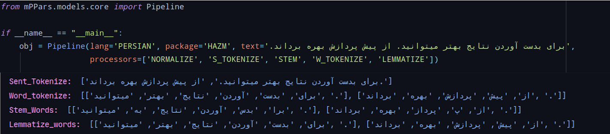

.. PartNLP documentation master file, created by
   sphinx-quickstart on Sun Jul 19 09:09:01 2020.
   You can adapt this file completely to your liking, but it should at least
   contain the root `toctree` directive.

Welcome to PartNLP's documentation!
===================================

.. toctree::
   :maxdepth: 2
   :caption: Contents:

.. image:: https://raw.githubusercontent.com/partdpai/PartNLP/master/images/PartAILogo.png

##############################################
PartNLP Project
##############################################
.. raw:: html

    <embed>   
	

	    

		

	    

	    

	    
	

	</embed>

Overview
#############

    This documentation is all about *PartNLP* package. PartNLP designes to help developers to perprocessing their text automatically! Also it has many useful features that makes perprocessing more fun! However, This is not an exhaustive description but it should show you how use the package effortlessly.

Introduction
#############
PartNLP is an integrated package uses many famous packages. Moreover, PartNLP supports multi languages.
In the below table you can see all valid operations accomplishing by PartNLP and their corresponder packages.

==============        ==============      ==================================
Operations               Keyword                   Packages
==============        ==============      ==================================
normalize               NORMALIZE                 HAZM, PARSIVAR
sent tokenize           S_TOKENIZE                HAZM, PARSIVAR, STANZA
word tokenize           W_TOKENIZE                HAZM, PARSIVAR, STANZA
lemmatize               LEMMATIZE                 HAZM,           STANZA
stem                    STEM                      HAZM, PARSIVAR, STANZA
==============        ==============      ==================================

Features
#############
This section provides a list of possible features supported by PartNLP. It able to:

* Use GPU
* Use multi thread
* Use multi processors
* Add custom stopwords
* Separate files for using GPU
* Remove specify range of characters
* Remove digits and Non-Persian letters
* Convert fnglish letters to persian letters

Installation
#############
for installing, you can simpley use pip to install the package.

>>> pip install -i https://test.pypi.org/simple/PartNLP

Usage
#############

In this section we are going to see the simple usage of PartNLP package.

.. image:: images/demo.gif

Examples
#############

Simple example:

>>> from PartNLP import Pipeline

#############

.. image:: images/example_of_validation.png

